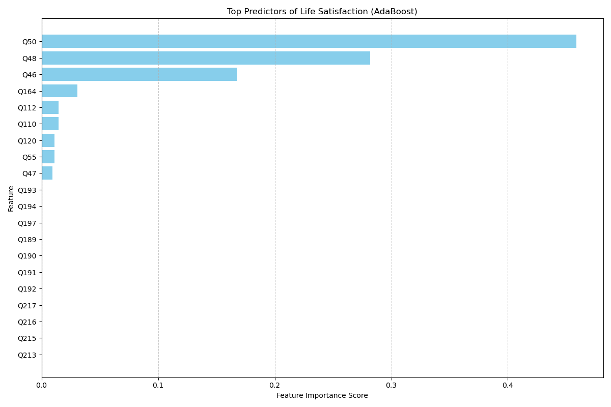
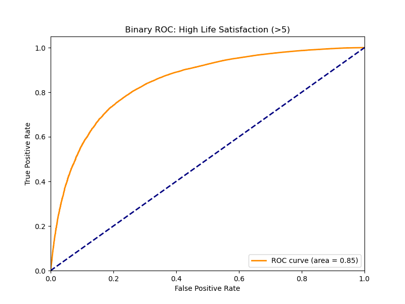

# WVS Data Cleaning and Analysis Project

## Overview
This project analyzes the World Values Survey (WVS) dataset to understand predictors of Life Satisfaction (`Q49`). The analysis involves data cleaning, imputation, feature selection using AdaBoost, and statistical modeling using Ordinal Logistic Regression.

## Changes Made

### 1. Data Loading & Cleaning
-   **Source**: `WVS_Cross-National_Wave_7_csv_v6_0.xlsx`
-   **Filtering**: Kept only columns `Q1` through `Q290`.
-   **Missing Values**: Replaced negative values (e.g., -1, -2) with `NaN`.
-   **Deduplication**: Removed duplicate rows.
-   **Final Data**: Saved as `WVS_Cross-National_Wave_7_cleaned.csv`.

### 2. Modeling Pipeline

#### Imputation
-   Missing values in predictors were imputed using the **median** strategy.

#### Feature Selection (AdaBoost)
We used `AdaBoostClassifier` to rank features by importance. Top predictors include:
1.  **Q50**: Satisfaction with financial situation
2.  **Q48**: Control over your life
3.  **Q46**: Happiness
4.  **Q164**: Importance of God
5.  **Q112**: Confidence: The Government

#### Ordinal Logistic Regression
We ran an Ordinal Logistic Regression on the top 9 selected features. All were found to be statistically significant (p < 0.000).

| Feature | Coef | Odds Ratio | Interpretation |
| :--- | :--- | :--- | :--- |
| **Q50** (Financial) | 1.06 | 2.90 | Strongest positive predictor. |
| **Q48** (Control) | 0.63 | 1.88 | Strong positive predictor. |
| **Q46** (Happiness) | -0.54 | 0.58 | Strong predictor (Negative coef = Happier). |

**Model Performance**:
-   **McFadden's Pseudo R-squared**: **0.1548** (Indicates a good fit for survey data).

### 3. ROC Curve and AUC Score
To evaluate predictive power, we binarized the outcome (High Satisfaction > 5).

-   **AUC Score**: **0.8461** (Excellent predictive power).

## Files in this Repository
-   `clean_wvs_data.py`: Script for data cleaning.
-   `verify_wvs_data.py`: Script for verification.
-   `run_modeling_pipeline.py`: Main modeling pipeline (Imputation -> AdaBoost -> Ordinal Logit).
-   `run_targeted_regression.py`: Script for the targeted regression analysis.
-   `generate_roc_curve.py`: Script to generate ROC curves.
-   `visualize_feature_importance.py`: Script to visualize feature importance.
-   `check_missing_rows.py`: Utility to check missing data.
-   `inspect_target.py`: Utility to inspect the target variable.
